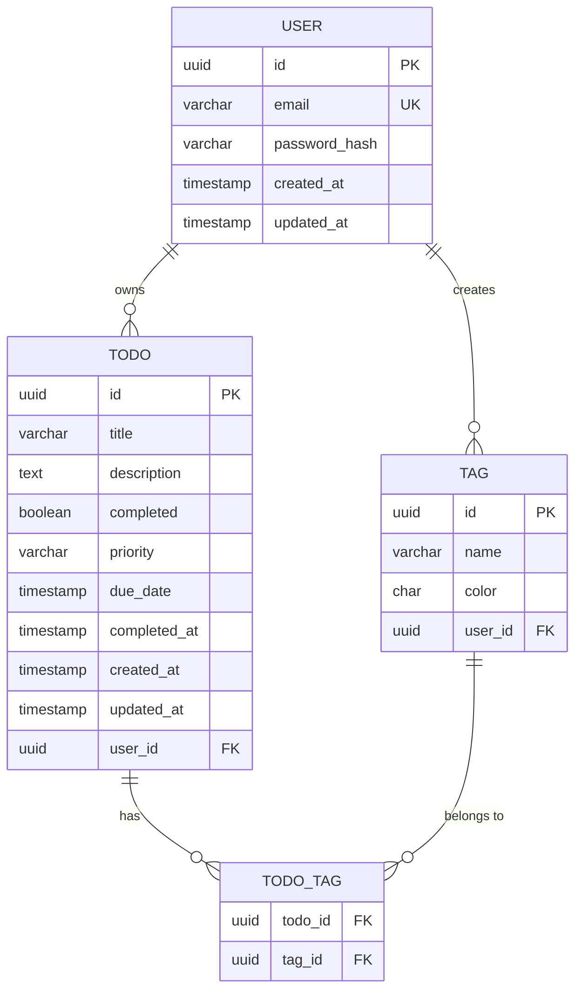

# Database Schema — TodosApp

> **Status:** Planned — no database has been created yet.  
> **Last Updated:** 2026-05-24  
> **Target DB:** PostgreSQL 15.x (recommended)

---

## Entity-Relationship Diagram



---

## Table Definitions (SQL — PostgreSQL)

### `users`
```sql
CREATE TABLE users (
  id            UUID PRIMARY KEY DEFAULT gen_random_uuid(),
  email         VARCHAR(255) NOT NULL UNIQUE,
  password_hash VARCHAR(255) NOT NULL,
  created_at    TIMESTAMP WITH TIME ZONE DEFAULT NOW(),
  updated_at    TIMESTAMP WITH TIME ZONE DEFAULT NOW()
);

CREATE INDEX idx_users_email ON users(email);
```

### `todos`
```sql
CREATE TABLE todos (
  id           UUID PRIMARY KEY DEFAULT gen_random_uuid(),
  user_id      UUID NOT NULL REFERENCES users(id) ON DELETE CASCADE,
  title        VARCHAR(255) NOT NULL,
  description  TEXT,
  completed    BOOLEAN NOT NULL DEFAULT FALSE,
  priority     VARCHAR(10) NOT NULL DEFAULT 'medium'
               CHECK (priority IN ('low', 'medium', 'high')),
  due_date     TIMESTAMP WITH TIME ZONE,
  completed_at TIMESTAMP WITH TIME ZONE,
  created_at   TIMESTAMP WITH TIME ZONE DEFAULT NOW(),
  updated_at   TIMESTAMP WITH TIME ZONE DEFAULT NOW()
);

CREATE INDEX idx_todos_user_id ON todos(user_id);
CREATE INDEX idx_todos_user_completed ON todos(user_id, completed);
CREATE INDEX idx_todos_user_priority ON todos(user_id, priority);
CREATE INDEX idx_todos_due_date ON todos(due_date) WHERE due_date IS NOT NULL;

-- Full-text search index
CREATE INDEX idx_todos_fts ON todos
  USING GIN(to_tsvector('english', title || ' ' || COALESCE(description, '')));
```

### `tags`
```sql
CREATE TABLE tags (
  id         UUID PRIMARY KEY DEFAULT gen_random_uuid(),
  user_id    UUID NOT NULL REFERENCES users(id) ON DELETE CASCADE,
  name       VARCHAR(50) NOT NULL,
  color      CHAR(7) NOT NULL DEFAULT '#3B82F6',  -- hex color
  created_at TIMESTAMP WITH TIME ZONE DEFAULT NOW(),
  UNIQUE(user_id, name)
);

CREATE INDEX idx_tags_user_id ON tags(user_id);
```

### `todo_tags` (Junction Table)
```sql
CREATE TABLE todo_tags (
  todo_id UUID NOT NULL REFERENCES todos(id) ON DELETE CASCADE,
  tag_id  UUID NOT NULL REFERENCES tags(id) ON DELETE CASCADE,
  PRIMARY KEY (todo_id, tag_id)
);
```

### `refresh_tokens` (for Auth)
```sql
CREATE TABLE refresh_tokens (
  id         UUID PRIMARY KEY DEFAULT gen_random_uuid(),
  user_id    UUID NOT NULL REFERENCES users(id) ON DELETE CASCADE,
  token_hash VARCHAR(255) NOT NULL UNIQUE,
  expires_at TIMESTAMP WITH TIME ZONE NOT NULL,
  created_at TIMESTAMP WITH TIME ZONE DEFAULT NOW()
);

CREATE INDEX idx_refresh_tokens_user_id ON refresh_tokens(user_id);
```

---

## Prisma Schema (if using Prisma ORM)

```prisma
// schema.prisma
generator client {
  provider = "prisma-client-js"
}

datasource db {
  provider = "postgresql"
  url      = env("DATABASE_URL")
}

model User {
  id           String   @id @default(uuid())
  email        String   @unique
  passwordHash String   @map("password_hash")
  createdAt    DateTime @default(now()) @map("created_at")
  updatedAt    DateTime @updatedAt @map("updated_at")
  todos        Todo[]
  tags         Tag[]
  refreshTokens RefreshToken[]

  @@map("users")
}

model Todo {
  id          String    @id @default(uuid())
  userId      String    @map("user_id")
  user        User      @relation(fields: [userId], references: [id], onDelete: Cascade)
  title       String    @db.VarChar(255)
  description String?   @db.Text
  completed   Boolean   @default(false)
  priority    Priority  @default(MEDIUM)
  dueDate     DateTime? @map("due_date")
  completedAt DateTime? @map("completed_at")
  createdAt   DateTime  @default(now()) @map("created_at")
  updatedAt   DateTime  @updatedAt @map("updated_at")
  tags        TodoTag[]

  @@index([userId])
  @@index([userId, completed])
  @@map("todos")
}

model Tag {
  id        String    @id @default(uuid())
  userId    String    @map("user_id")
  user      User      @relation(fields: [userId], references: [id], onDelete: Cascade)
  name      String    @db.VarChar(50)
  color     String    @default("#3B82F6")
  createdAt DateTime  @default(now()) @map("created_at")
  todos     TodoTag[]

  @@unique([userId, name])
  @@index([userId])
  @@map("tags")
}

model TodoTag {
  todoId String @map("todo_id")
  tagId  String @map("tag_id")
  todo   Todo   @relation(fields: [todoId], references: [id], onDelete: Cascade)
  tag    Tag    @relation(fields: [tagId], references: [id], onDelete: Cascade)

  @@id([todoId, tagId])
  @@map("todo_tags")
}

model RefreshToken {
  id        String   @id @default(uuid())
  userId    String   @map("user_id")
  user      User     @relation(fields: [userId], references: [id], onDelete: Cascade)
  tokenHash String   @unique @map("token_hash")
  expiresAt DateTime @map("expires_at")
  createdAt DateTime @default(now()) @map("created_at")

  @@index([userId])
  @@map("refresh_tokens")
}

enum Priority {
  LOW
  MEDIUM
  HIGH
}
```

---

## Migrations Strategy

- Use Prisma Migrate (or Flyway/Liquibase for raw SQL projects)
- All migrations stored in `prisma/migrations/` or `db/migrations/`
- Never edit past migrations — always create new ones
- Migration naming: `YYYYMMDDHHMMSS_description`

---

## Seed Data

```sql
-- Test user (password: "password123")
INSERT INTO users (id, email, password_hash)
VALUES (
  '00000000-0000-0000-0000-000000000001',
  'demo@todosapp.com',
  '$2b$10$...'  -- bcrypt hash
);

-- Sample todos
INSERT INTO todos (user_id, title, priority)
VALUES
  ('00000000-0000-0000-0000-000000000001', 'Buy groceries', 'medium'),
  ('00000000-0000-0000-0000-000000000001', 'Finish report', 'high'),
  ('00000000-0000-0000-0000-000000000001', 'Exercise', 'low');
```
