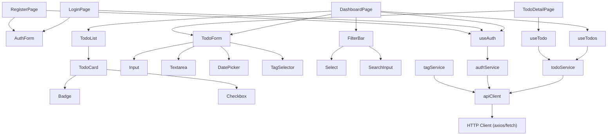
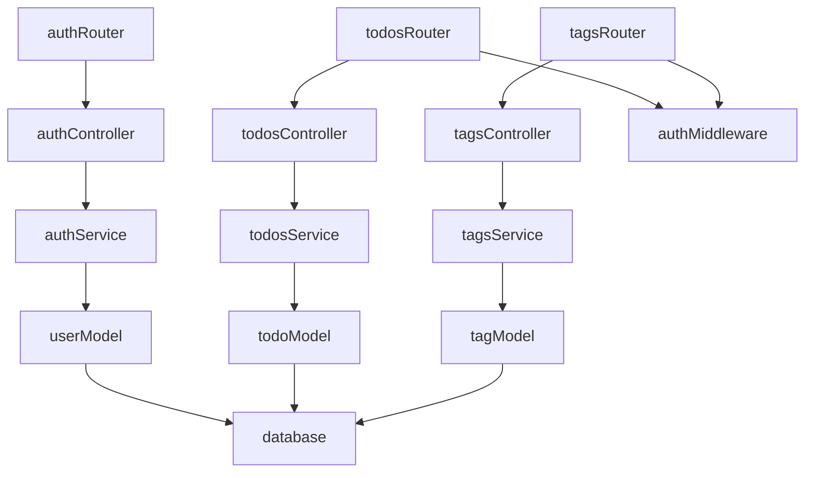

# Dependency Graph — TodosApp

> **Status:** No source code exists yet. Graph below is a **planned** dependency model.  
> **Last Updated:** 2026-05-24

---

## Module Dependency Graph (Planned)



---

## Backend Dependency Graph (Planned)



---

## External Dependencies (Planned)

| Package | Used By | Purpose |
|---------|---------|---------|
| react | All frontend | UI rendering |
| react-router-dom | App router | Client-side routing |
| axios | apiClient | HTTP requests |
| zustand / redux | State stores | Global state |
| react-hook-form | Forms | Form validation |
| zod | Validators | Schema validation |
| date-fns | DatePicker | Date utilities |
| express | Backend | HTTP server |
| prisma | Models | Database ORM |
| jsonwebtoken | authService | JWT signing |
| bcryptjs | authService | Password hashing |
| cors | Express middleware | CORS handling |

---

## Circular Dependency Rules

> **Rule:** No circular imports are allowed.  
> **Enforcement:** Use ESLint `import/no-cycle` rule.

Dependency direction MUST flow:
```
Pages → Components → Hooks → Services → API Client
                           → Store
```

Never:
- A service importing from a component
- A hook importing from a page
- A model importing from a controller

---

*Regenerate this graph after the first commit with actual source code.*
